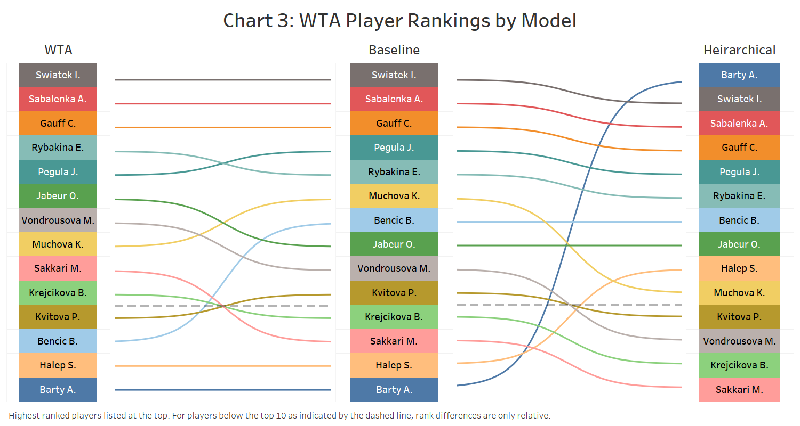

# Baysian Modelling of 2023 WTA Match Outcomes

Capstone project for the Bayesian Statistics: Techniques and Models course at UC Santa Cruz. 

The objective of this report is to better understand the contributing factors that explain the outcome of Women’s Tennis Association (WTA) tennis matches in 2023. To do so, a Bayesian logistic model will be fit using a Monte Carlo Markov Chain (MCMC) simulation and the Metropolis-Hastings algorithm. Player rankings obtained from the model can be compared with the WTA tennis rankings at the time of the paper for validation and further insight.

Of the top 10 ranked WTA players as of November 8th, 2023, 8 were also among the top 10 players in terms of match winningness based on the fitted Bayesian model. Furthermore, the top 3 ranked WTA players – Iga Swiatek, Aryna Sabalenka, and Coco Gauff – had consistent rankings in the Bayesian model.

While hypothesized to be an important match outcome predictor in the equivalent men’s Associate of Tennis Professionals (ATP) tour, inclusion of player interaction effects with different playing surfaces (i.e., hard court) upon inference in the WTA model was not found to improve differentiation of match outcomes.  

The differential between fitted player scores in a match had a 79% area under the curve (AUC) when differentiating observed match outcomes. This indicates that simply by linearly ranking each WTA player (using a Bayesian model) and inferring that the player with the superior rank will win, one can expect to get 79% of inferences correct (at least retroactively on 2023 data). 

See the [report]([https://github.com/user/repo/blob/branch/other_file.md](Baysian-Modelling-of-2023-WTA-Match-Outcomes/blob/main/Bayesian%20Modelling%20of%202023%20WTA%20Match%20Outcomes.pdf) for further details. 
